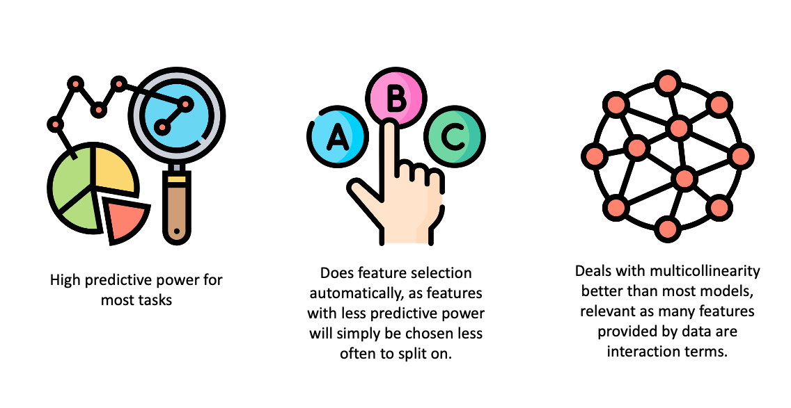
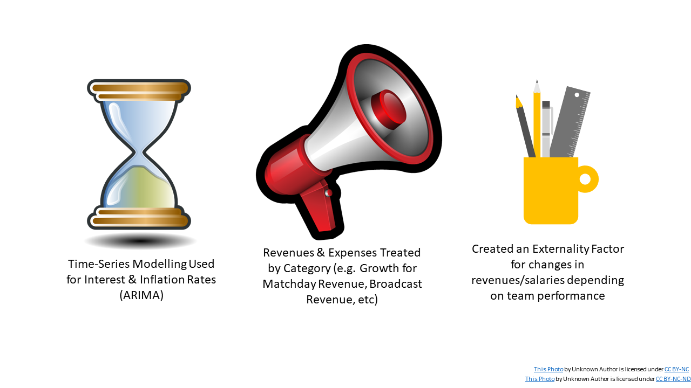
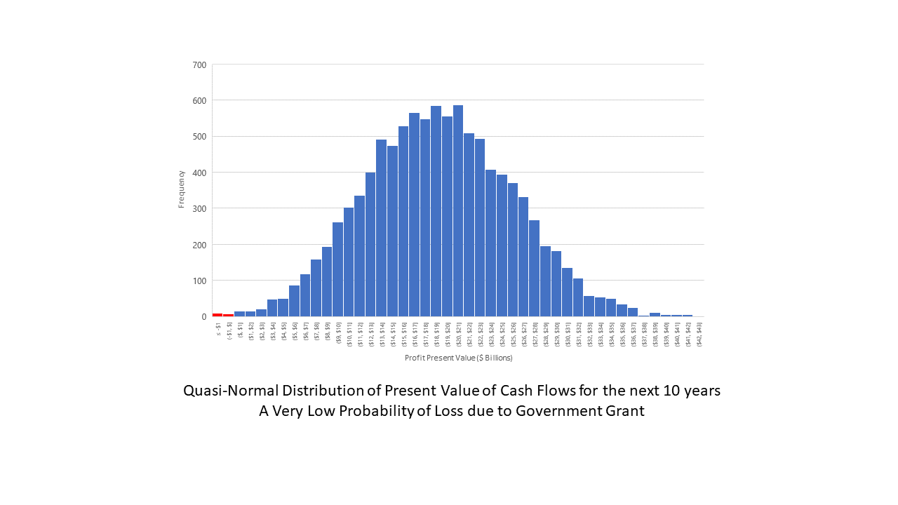
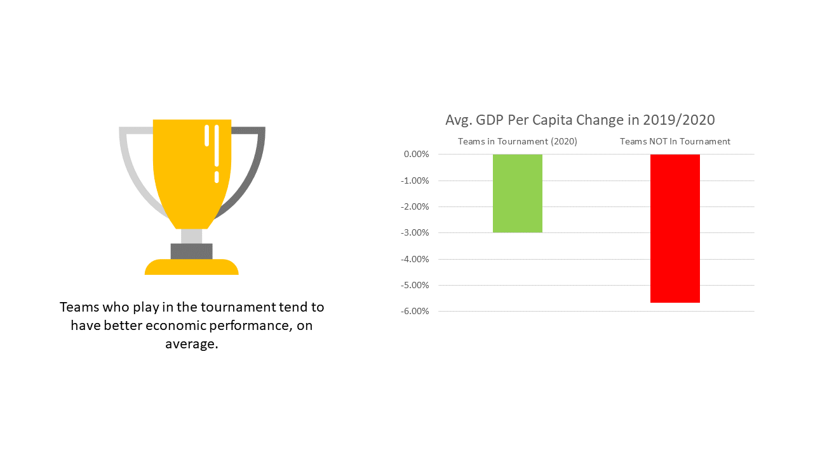
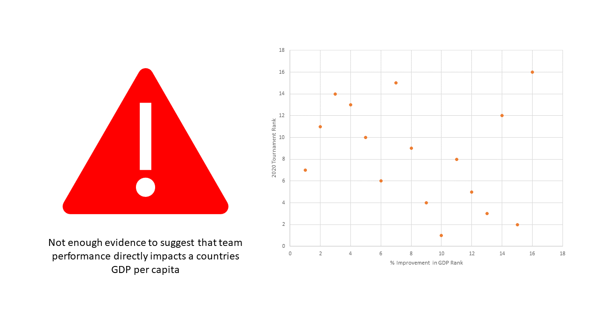
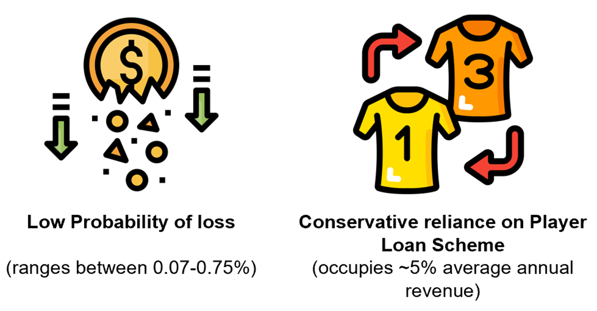
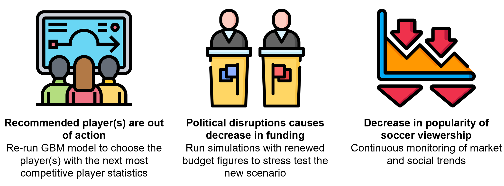

# Team "Park the Bus" SOA Challenge Showcase 
>By: Nicholas Nguyen, Nathan Ng, Sean Stephen, William Li and Brittanie Hsu
---

## Executive Summary 

Rarita’s football players has found moderate success in the international scene of football however not when
representing Rarita as a nation. After recognising competitive sports team generally have benefits for the country’s
economy and global visibility, Rarita had explored ideas for creating a national team to participate in the
international Football and Sporting Association (FSA) League.

The Rarita national team had been developed with the objective for a high probability for winning the Football and
Sporting Association (FSA) League and to have a positive impact on Rarita’s economy. The gradient boosting
model was used for identifying player effectiveness after comparing several after models. A team of the best 24
players were selected using the model, which can be accessed [here](Player-Selection.csv).

This combination of players had a high probability of 89.33% to be in the top 10 football nations in the next 5 years
and 41.65% for winning the championship within 10 years. Moreover, the team was found to a positive impact on
Rarita’s economy with an expected NPV of $18.742 billion and statistical evidence of increased GDP growth with a
national football team.

## Data Cleaning 
### Key Assumptions
A key assumption made when building the model was that the effectiveness of a player was justified only by the provided data. Players are assumed to be independant from each other and no effects on chemistry was considered. Furthermore, the team selected was assumed to be the best team at this present time and that it is possible that the team will be updated with future data and statistics. Team selection is a dynamic process. 

### Handling Dirty Data 
To deal with missing and dirty data, several assumptions were made as highlighted below:  

* Missing data was imputed by substituting the average value of the specific column and position
* Values below 0 that were deemed not sensible were substituted as 0 
* Values above 100 that were deemed not sensible were substituted as 100

## Modelling

### GBM Model 
To analyse the effectiveness of different players, we implemented a gradient boosting model using the tournament dataset with player stats as features and the rank of their nation in the 2021 tournament as the target.  

Gradient boosting was chosen for several reasons: 

The package XGBoost was applied in R, automatically regularising trees built in the later iterations in order to stop overfitting.

Nation rank was chosen as the target variable as it is most directly related to our objective. 4 separate models were trained for defenders, midfielders, forwards, and goalkeepers, with players who can play multiple positions being considered for each separately. The model could be used to pick the strongest players as well as make predictions for nations. To predict the rank of a nation, we computed the average model output amongst their players in each of the 4 positions respectively, then took the overall average of those 4 position averages.

Firstly, a model was both trained and applied using the tournament dataset by splitting the data into training and test sets. As that was successful, it was then trained on the full tournament dataset and used to predict on a modified version of the league dataset where values are scaled to match the tournament data. Code for modelling can be accessed [here](SOA-GBM-Model.md). The accuracy of training a model on tournament data and using it to predict on league data is hard to evaluate as not all tournament players play in the league, but the accuracy was good for the countries with enough data, with a correlation of 0.5692. Details can be seen [here](League-Prediction-Evaluation.csv), note that "DF in League" means the number of defenders in the country's national team that also play in the league, and likewise for "MF in League", "FW in League" and "GK in League".

### PCR Model 
A PCR model was also used as an alternative for player selection by first modelling using an unsupervised approach which didn't produce any meaningful difference between different player levels. A supervised regression approach was then conducted however was found to be not as effective as the GBM model.

More detail on the results of the PCR model can found in the code file attached [here](PCR_Model_Markdown.md)

## Team Selection 

Using the model trained on the tournament dataset and applying it to the league dataset, the top players from Rarita in each position were chosen (click [here](Player-Selection-Full.csv) to see the players).

The predicted ranking for each position and overall for Rarita are:

|Position|Predicted Rank|
|---|---|
|DF|6.5691|
|MF|3.7112|
|FW|4.8218|
|GK|5.1986|
|Overall|5.0752|

Using simulations, the probability of being top 10 in 5 years is 89.33% and the probability of winning a championship within 10 years is 41.65%. Both estimates are made with conservative assumptions. 

The total annual salary of the current players chosen is 139.42 million, which should easily be covered by Rarita’s football yearly profit which over the past 5 years was 352.16 million on average. The initial budget of 995 million on top of that can be used for one-off expenses required to start a team, staff expenses and to absorb potential shocks such as inflation. Thus, liquidity should not be an issue so non-governmental funding is not deemed necessary. 

## Economic Impact

To determine the net present value, revenues, expenses and profits of the firm, interest and inflation rates, extensive modelling was undertaken using time series models for interest and inflation rates (ARIMA models), forecasting of the different groups of revenues/expenses individually and through the creation of an exponential externality factor.

After constructing this model, we were able to repeat 10000 simulations to arrive at an average net present value value and a distribution of simulations as below. This let us work out both empirical and theoretical probabilties of loss and earning a certain amount of profit (as present value).

Alongside the modelling, we can use our data to determine whether or not a soccer team is a worthwhile investment in a country by how having a soccer team as himpacted thier increase in GDP per capita in the year they were included in the tournament. There is a significant difference in the average of the GDP per capita changes when a country was playing in the tournament as detailed below.

Furthermore, it is not just whether or not a team is included in the tournament, but whether they perform any good in the tournament. We can see this through a comparison below that this isn't a paramount factor to GDP per capita.

An example of 10,000 simulations of net present value, reveneues, expenses, profits and financial rates [here](ThousandSimulations.csv)
## Implementation Plan
### Key Plan Components

### Implementation Timeline

### Revenue, Expense and Profit Projections

* Average revenues and expenses were determined with 10 000 simulations of Rarita rankings and their projected financial impacts 

## Risks and Mitigation
### Financial Risks 

### Qualitative Risks 

